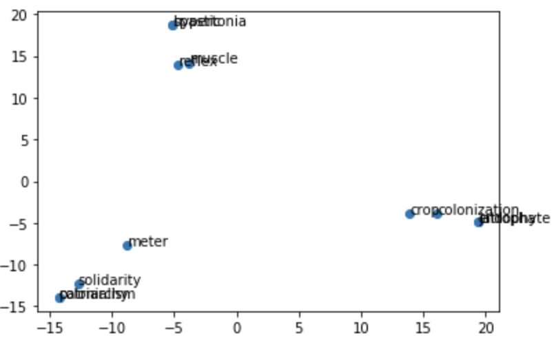

# Knowledge Graph Project (FORWARD Data Lab)

## Description

Here we extract `1.7m` documents from the arXiv dataset available in https://www.kaggle.com/Cornell-University/arxiv. Moreover, we use `100,000` keywords to track word frequency and co-occurrence within each document.

Our goal is to build a knowledge graph to find related words using the metric `PMI`. Additionally, we project the co-occurrence matrix into a 2D plot to visualize the similarity and dissimilarity among words and clusters.

## Result
- `Query` => related words
- requirement document => data entity, database design, business process 
- second language acquisition => second language writing, contrastive analysis, english as second language
- bernouli distribution => multiple outcome, dynamic decision making, multivariate gaussian model
- business concept => customer segment, strategic change, research knowledge
- algorithm => attribute oriented induction, coding algorithm, resource allocation algorithm

## Visualization

We observe that similar words form a word cluster.
